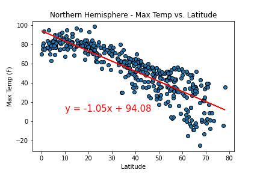
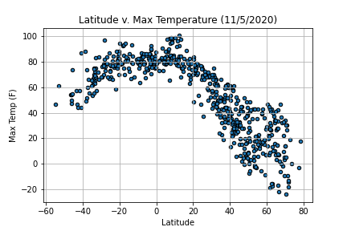

# Api-Challenge

## Table of Contents
* [Description](#description)
* [Preview](#preview)

## Description
In this example, I'll be creating a Python script to visualize the weather of 500+ cities across the world of varying distance from the equator. To accomplish this, I'll be utilizing a simple Python library, the OpenWeatherMap API, and a little common sense to create a representative model of weather across world cities.
My objective is to build a series of scatter plots to showcase the following relationships:

* Temperature (F) vs. Latitude
* Humidity (%) vs. Latitude
* Cloudiness (%) vs. Latitude
* Wind Speed (mph) vs. Latitude

## Preview
Here are some previews of the charts I had to build for this assignment 

## More Info
Github: https://github.com/aspivak5

Email: aaron.spivak5@gmail.com